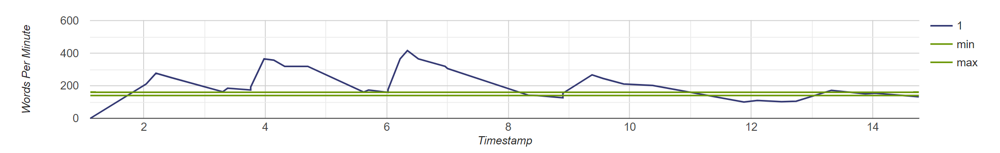

In this post I show you how to analyze your speaking words per minute using the OpenAI Audio Transcription API. 

# Background

We recently had a meeting at work where people shared their team's accomplishments from the previous quarter and what they would be doing in the upcoming quarter.

As I usually do, I prepared slides to try and make things entertaining and informative. 
I also prepped a few times by walking through what I would say, without making it too rigid.

The meeting went well and I thought I did a solid job sharing what our team had done. 
I felt comfortable sharing the content and felt like I went at a good pace. 
I let my wife know, she smiled and said "Great job!", and I didn't think much of it.

After these meetings someone usually shares a recording for people who couldn't make it. 
When my manager did that, I figured I would give it a quick watch to see how my part went.

To my surprise, I was talking much faster than I thought I was :)

Right away I went to tell my wife and she smiled. 
My office is upstairs but not closed in. 
She had heard me talking and knew it was too fast but didn't want to say anything.

At this point I realized there was a gap between my self perceived speaking speed and my actual speaking speed.

# Looking for a solution

My first response in situations like this is to figure out how to improve. 
So I immediately started looking for books and public speaking coaches, of which there are many.

Unfortunately, a lot of the public speaking coaches are not available or were more expensive than what I wanted to spend. 
I also didn't want to go through the process of reaching out, scheduling a meeting, interviewing them, etc.

What I really want is to understand what makes for good public speaking and then get an objective assessment of how I am doing, so that I can improve.

I started seeing posts about the ideal speaking words per minute (140-160) and other things like the use of filler words, pauses, and intonation. 
All things I had heard of before but had never assessed myself against.

# Getting objective feedback using OpenAI

While there are many attributes to great public speaking, I wanted to start with something simple - speaking pace.

In order to do this, I figured I just needed something that could take audio as an input and let me know which words were spoken and when, then it's easy to calculate speaking rate.

Thankfully OpenAI has a great API to do this - their Audio Transcription API.

The documentation starts by talking about this capability as [Speech to text](https://platform.openai.com/docs/guides/speech-to-text), it's pretty straightforward. Specifically though we want timestamps. And lucky for us 
they have a [section for that](https://platform.openai.com/docs/guides/speech-to-text/timestamps)!

We can see a snippet here of how to call the API:

```
curl https://api.openai.com/v1/audio/transcriptions \
  -H "Authorization: Bearer $OPENAI_API_KEY" \
  -H "Content-Type: multipart/form-data" \
  -F file="@/path/to/file/audio.mp3" \
  -F "timestamp_granularities[]=word" \
  -F model="whisper-1" \
  -F response_format="verbose_json"
```

This looks like exactly what we want - to pass the API our recording and get back JSON with timestamps of each word. 
From there, we can calculate our speaking rate.

To test this out I recorded a short audio clip of me talking at various talking speeds. 
I then wrote a simple C# function to call the API. 
The API response looks like this:

```json
{
  "task": "transcribe",
  "language": "english",
  "duration": 15.40999984741211,
  "text": "This is a recording of me talking. This is a recording of me talking faster. This is a recording of me talking even faster. This is a recording of me talking slower. This is a recording of me talking slower.",
  "words": [
    {
      "word": "This",
      "start": 0.5799999833106995,
      "end": 1.100000023841858
    },
    {
      "word": "is",
      "start": 1.100000023841858,
      "end": 1.3200000524520874
    },
    {
      "word": "a",
      "start": 1.3200000524520874,
      "end": 1.4600000381469727
    },
    ...
  ]
}
```

From this API response we can see all of the text, how long the audio is, and the start and end time for each word that was spoken.

Looks great! 
From here all we need to do is process the data to calculate WPM. 
The method I used is to take the average words per second (WPS) from the most recent 5 words and use that to calculate the average speaking rate. 
Once we do that, we get the following:

```json
{"Timestamp":1.100000023841858,"WordsPerMinute":0.0}
{"Timestamp":1.100000023841858,"WordsPerMinute":0.0}
{"Timestamp":1.100000023841858,"WordsPerMinute":0.0}
{"Timestamp":1.100000023841858,"WordsPerMinute":0.0}
{"Timestamp":2.0399999618530273,"WordsPerMinute":205.0}
{"Timestamp":2.200000047683716,"WordsPerMinute":272.0}
{"Timestamp":2.4600000381469727,"WordsPerMinute":254.0}
{"Timestamp":3.299999952316284,"WordsPerMinute":163.0}
{"Timestamp":3.380000114440918,"WordsPerMinute":187.0}
{"Timestamp":3.759999990463257,"WordsPerMinute":174.0}
{"Timestamp":3.759999990463257,"WordsPerMinute":192.0}
{"Timestamp":4.0,"WordsPerMinute":319.0}
{"Timestamp":4.139999866485596,"WordsPerMinute":357.0}
{"Timestamp":4.320000171661377,"WordsPerMinute":319.0}
{"Timestamp":4.679999828338623,"WordsPerMinute":326.0}
{"Timestamp":5.599999904632568,"WordsPerMinute":163.0}
{"Timestamp":5.699999809265137,"WordsPerMinute":176.0}
{"Timestamp":6.019999980926514,"WordsPerMinute":159.0}
...
```

Each row is an object showing the timestamp of the end of the last word and the average WPM for the most recent 5 words. 
You can see the first four records are 0 since there is insufficient data to calculate the WPM.

WHile this isn't the exact audio from when I spoke, it gives us a sense of how fast we are speaking at various perceived speeking speeds.

# Visualizing speaking speed

The data looks approximately right (after fixing some bugs) but it's much easier if we can see a visualization.

To do that I used [Google Charts](https://developers.google.com/chart/interactive/docs). 
They have easy to use components to graph and display pretty much anything you can think of.

To set this up, we need to figure out how to map the WPM data we created above to a JSON structure that works for the graphing library. 
I'd also like to add lines to the graph that show the range of recommended speaking speeds, to make it easy to understand.

To display this, we will use a [line chart](https://developers.google.com/chart/interactive/docs/gallery/linechart).

We can add something simple to the C# code to print the data structure we need for the Google Library.

Each sub-array will have:

- The timestamp
- WPM
- Min recommended value
- Max recommended value

It looks like this:

```json
[
    [1.1200000047683716, 0.0, 140.0, 160.0], 
    [1.1200000047683716, 0.0, 140.0, 160.0], 
    [1.1200000047683716, 0.0, 140.0, 160.0], 
    [1.1200000047683716, 0.0, 140.0, 160.0], 
    [2.0399999618530273, 211.0, 140.0, 160.0], 
    [2.200000047683716, 277.0, 140.0, 160.0], 
    [2.4600000381469727, 249.0, 140.0, 160.0], 
    [3.299999952316284, 163.0, 140.0, 160.0], 
    [3.380000114440918, 185.0, 140.0, 160.0], 
    [3.759999990463257, 174.0, 140.0, 160.0], 
    [3.759999990463257, 192.0, 140.0, 160.0], 
    [3.9800000190734863, 365.0, 140.0, 160.0],
    [4.139999866485596, 357.0, 140.0, 160.0], 
    [4.320000171661377, 319.0, 140.0, 160.0], 
    [4.699999809265137, 319.0, 140.0, 160.0], 
    [5.619999885559082, 161.0, 140.0, 160.0],
    ...
]
```

And when we render the graph, we see the following:



This graph gives us a sense of when we are speaking too fast or too slow.

Also note that the graph is a bit choppy. We can do some work there to smooth the graph (and I was talking at artifically fast/slow paces on purpose).

# What's next?

Now that I've got this working, I plan to add more features like checking for filler words, intonation, pauses, and more. 
Another interesting one will be to assess the "grade level" of the speach - similar to what you might do for an article you write, to see if it's simple enough.
